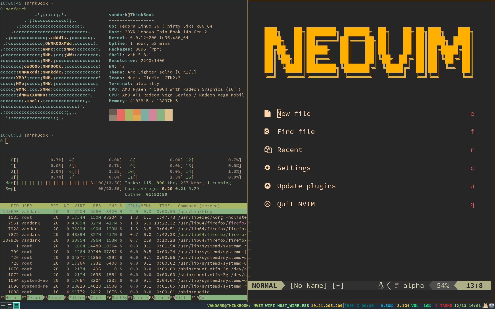
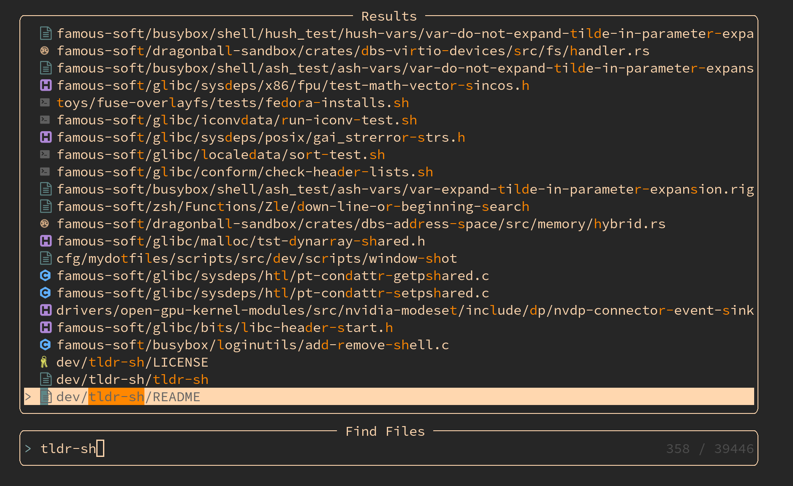

# dotfiles

使用`stow`管理我的配置文件

## 内容

### alacritty

使用的字体是`SauceCodePro Nerd Font`，这是`Source Code Pro`的`Nerd`版本。

使用的主题配色是`Gruvbox Material Dark Medium`。

### i3 & i3blocks

`i3blocks`中的配置文件依赖于一些我写的或者网上找到的脚本，可能在其他机器上运行效果不好，需要根据用途修改。

配置好了的效果如下：


### nvim

使用的是轻量化的插件管理器`vim-plug`，~~而且我认为`vim`并不需要很优秀的补全方案，如果实在很依赖智能补全，完全可以使用`VS code`或者`IDE`搭配它们提供的`vim`插件，因此我安装插件的原则还是够用就行，尽量精简。~~

**补全框架真的香！**

---

**我使用的插件：**

| 插件功能 | 插件名 |
| --- | -- |
| 括号自动补全 | `jiangmiao/auto-pairs` |
| 彩虹括号 | `luochen1990/rainbow` |
| 为起始页提供更多功能 | `goolord/alpha-nvim` |
| 更方便地使用内置终端 | `skywind3000/vim-terminal-help` |
| 更方便地运行外部命令 | `skywind3000/asyncrun.vim` |
| `markdown`预览插件 | `iamcco/markdown-preview.nvim` |
| 一种很好看的配色 | `morhetz/gruvbox` |
| 可以`sudo`保存文件 | `lambdalisue/suda.vim` |
| 显示缩进线 | `Yggdroot/indentLine` |
| 括号编辑 | `tpope/vim-surround` |
| 状态栏 | `nvim-lualine/lualine.nvim` |
| 代码片段 | `hrsh7th/vim-vsnip` |
| 查找、过滤、预览、选择 | `nvim-telescope/telescope.nvim` |

**提供的功能：**

- `<Leader>rn`编译并运行（预览）`bash` `python` `c` `lisp` `tex` `asm` `rust`的代码文件
- `<Leader>m`预览`markdown`文件
- `<Leader>ff`查找文件
- `<Leader>fg`在工作路径下查找
> 使用此功能需要`ripgrep`
- `<Leader>fb`列出所有的缓冲区
- `<Leader>fh`列出帮助
- `<Leader>t`打开或关闭错误提示

文件搜索效果：



代码一键运行效果：


---

**代码补全：**

用到的插件有 `neovim/nvim-lspconfig` `hrsh7th/cmp-nvim-lsp` `hrsh7th/cmp-buffer` `hrsh7th/cmp-path` `hrsh7th/cmp-cmdline` `hrsh7th/nvim-cmp` `hrsh7th/cmp-vsnip` `hrsh7th/vim-vsnip` `neovim/nvim-lspconfig` `simrat39/rust-tools`

支持 lua rust C / C++ python bash

补全提示效果：


---

**其他：**

`:make` 会在当前目录下执行`./build.sh`，这只是我的个人习惯，可以删去`lua/basic.lua`中的`set.makeprg = './build.sh'`

执行完`make`之后可以使用`copen`查看信息。

### ranger

只是安装了一个主题`ranger_devicons`

``` bash
git clone https://github.com/alexanderjeurissen/ranger_devicons ~/.config/ranger/plugins/ranger_devicons
```

### urxvt

使用的也是`Gruvbox`主题。

`urxvt`配置较为麻烦的一点就是字体文件只有写入配置文件才会被使用，你可以使用命令`fc-list | awk -F : '{ print $2 }'`来查看你的系统中字体的名字。

### user-dirs

关于用户目录中如`Download`、`Documents`等子目录的本地化配置。

### zsh

我认为使用如`oh-my-zsh`这样的插件管理器会让`zsh`的启动速度变慢很多，因此我是手动管理的插件。

在我使用`Archiso`和发行版`grml`的时候，我意外地发现它们的默认`zsh`配置是如此地好用，因此我使用的是来自`grml`官网的配置文件，而我自己的配置在`.zsh_custom_rc`中。

安装`grml`[官网](https://grml.org/zsh)的教程，可以很轻松地下载到`grml`配置的`zshrc`：
``` bash
wget -O .zshrc https://git.grml.org/f/grml-etc-core/etc/zsh/zshrc
```

我使用的插件：

| 插件功能 | 插件名 |
| --- | -- |
| 使用`fzf`快速补全 | `fzf-tab.plugin.zsh` |
| 像`fish`一样高亮 | `zsh-syntax-highlighting.zsh` |
| 在敲命令时实时提示 | `zsh-autosuggestions.zsh` |
| 提供更强大的补全 | `zsh-completions.plugin.zsh` |
| `C-r`搜索历史记录时使用`fzf` | `zsh-fzf-history-search` |

### 40-libinput.conf

`libinput`的触摸板配置。
